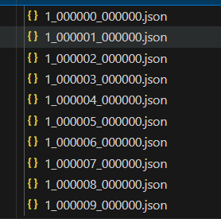

# 启动命令

```shell
bash sglang_infer.sh --model_path /data/models/Qwen2.5-0.5B-Instruct --tp_size 1 --input_path /data/data/test.json --output_path /data/data/test --batch_size 100 --max_new_tokens 128 --core vllm
```

# 说明
如果是8张卡，tp_size设置为4，ray就会每个节点起两个actor，每个actor单独处理数据，每batch_size个输出会保存为一个json文件。类似如下形式:


# 注意
注意设置环境变量，在shell脚本里，例如:
```shell
GPUS_PER_NODE=8
RANK=$RANK
NNODES=$WORLD_SIZE
```
